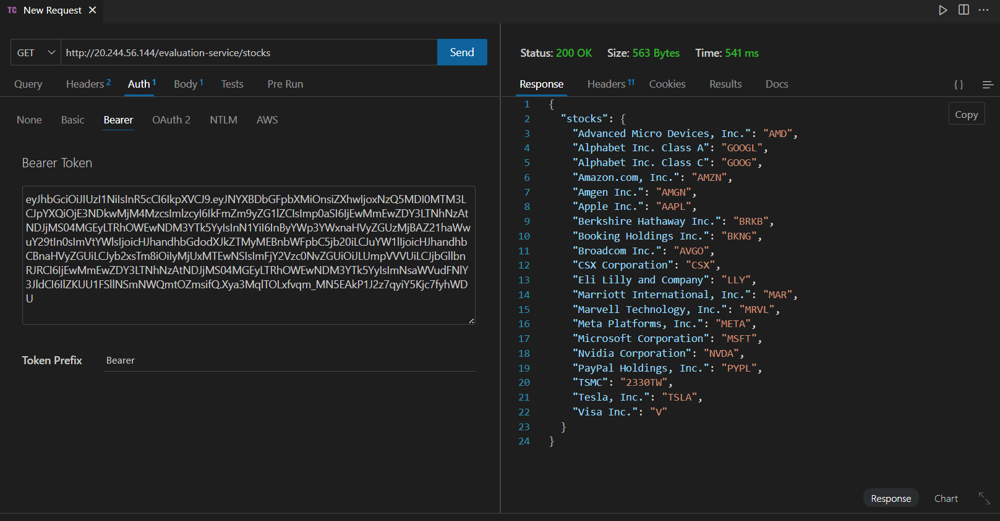
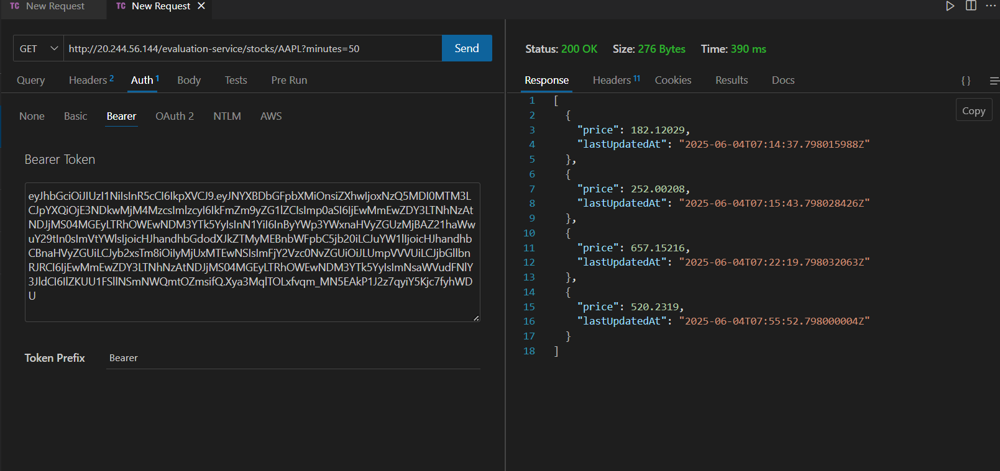

# 📊 Stock Price Aggregation & Correlation Microservice

This project is a **Full Stack coding assessment submission**. It involves building a **Node.js + Express-based HTTP microservice** to consume stock price data from a stock exchange API, calculate averages, and determine correlation between two stocks’ price movements.

---

## 📌 Tech Stack

- **Backend:** Node.js, Express
- **HTTP Client:** axios
- **API Testing:** Insomnia / Postman

---

## 📂 Project Structure

```
/project-root/
├── /controllers/
│   └── stockController.js
├── /routes/
│   └── stockRoutes.js
├── app.js
├── package.json
└── README.md
```

---

## 🚀 How to Run the Project

### 📦 Install Dependencies

```bash
npm install
```

### 🏃 Start Server

```bash
npm start
```

Server will run on `http://localhost:5000/`

---

### ✅ Auth with token


## 📡 Available API Endpoints

### ✅ Get Average Stock Price & Price History

**Request**

```
GET /api/stocks/
```


**Example**

```
GET http://localhost:5000/api/stocks/NVDA?minutes=50
```


**Response**

```json
{
  "averageStockPrice": 321.45,
  "priceHistory": [
    {
      "price": 520.69,
      "lastUpdatedAt": "2025-05-03T06:25:49.559294482Z"
    },
    ...
  ]
}
```

---

### ✅ Get Correlation Between Two Stocks

**Request**

```
GET /api/stockcorrelation?minutes=50&ticker=NVDA&ticker=PYPL
```

**Example**

```
GET http://localhost:5000/api/stockcorrelation?minutes=50&ticker=NVDA&ticker=PYPL
```




**Response**

```json
{
  "correlation": 0.86,
  "stocks": {
    "NVDA": {
      "averagePrice": 300.12,
      "priceHistory": [...]
    },
    "PYPL": {
      "averagePrice": 185.45,
      "priceHistory": [...]
    }
  }
}
```

---

## 📌 Notes

- Uses stock exchange APIs (provided in assessment) for all data.
- No database or user authentication implemented.
- Data structures, average, and correlation calculations handled internally.

---

## 📚 Formulas Used

### Average

```
average = (sum of all prices) / (number of prices)
```

### Pearson’s Correlation Coefficient

```
ρ = cov(X, Y) / (σx * σy)
```

Where:
- cov(X, Y) = covariance between X and Y
- σx, σy = standard deviations

---

## 📝 Author

**Prajwal Ghurde**
_College Roll Number: <your-roll-number-here>_
